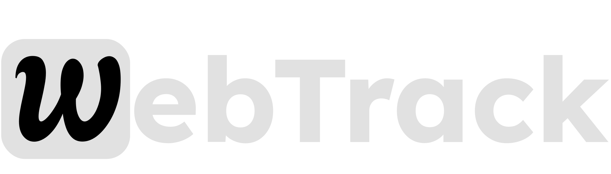

## Table of Contents
- [Tech Stack](#tech-stack)
- [Installation](#installation)
  - [Prerequisites](#prerequisites)
  - [Clone the Repository](#clone-the-repository)
  - [Install Dependencies](#install-dependencies)
  - [Set Up Environment Variables](#set-up-environment-variables)
  - [Run the Development Server](#run-the-development-server)
- [Usage](#usage)
- [Proof of Work](#proof-of-work)
- [Future Work](#future-work)
- [Hire Me](#hire-me)


### Tech Stack


| Technology      | Description                               |
|-----------------|-------------------------------------------|
| Next.js 15      | React framework for building server-side rendered (SSR) applications. |
| Supabase        | Open-source backend-as-a-service providing authentication, real-time databases, and storage. |
| Typescript      | A superset of JavaScript that provides static typing and enhances development experience. |
| shadcn/ui       | A modern UI component library for React, used for building user interfaces. |
| Tailwind CSS    | A utility-first CSS framework for rapidly building custom user interfaces. |
| Docker (Under development) | Containerization platform for deploying applications in isolated environments. |
| AWS ECS (Under development)  | Amazon Web Services Elastic Container Service for deploying and managing Docker containers. |
| Vercel          | A platform for frontend frameworks and static sites, optimized for Next.js deployments. |


### Installation

To get started with the project, follow these steps to set up your local development environment.

1. #### Prerequisites

    Before installing the project, make sure you have the following tools installed:

    - [Node.js](https://nodejs.org/) (version 18 or higher)
    - [npm](https://www.npmjs.com/) or [Yarn](https://yarnpkg.com/)
    - A [Supabase](https://supabase.com/) account

2. #### Clone the Repository

    Clone the project repository to your local machine using Git:

    ```bash
    git clone https://github.com/RahulBisht001/webtrack.git

    cd your-repository
    ```

3. #### Install Dependencies

    ```bash
    npm install
    ```
    >Or, using yarn:

    ```bash
    yarn install
    ```

    This will install the required packages listed in the `package.json` file, including dependencies like `Next.js`, `Supabase client`, and others.

4. #### Set Up Environment Variables

    in the `.env.local` file
    ```bash
    NEXT_PUBLIC_SUPABASE_URL=your-supabase-url
    NEXT_PUBLIC_SUPABASE_ANON_KEY=your-supabase-anon-key
    ```
    in `.env` file
    ```bash
    NEXT_PUBLIC_WEBSITE_NAME=your-website-link
    ```

5. #### Run the development server
    Now that your environment is set up, you can start the development server. This will allow you to preview the app locally.

    ```bash
    npm run dev
    ```

### Usage

This tool is best for developer specially for beginners.
After successfully creating an account, you just have to list your website. This tool will give you a tracking script that you have to add in the head section of your app.

Not just that it also provides custom events. In this feature you just need to generate your api key and once the key is generate it provides you a custom event tracking code which you can add anywhere, literally anywhere.
e.g want to check how many people accessed your payment page or how may clicked a specific button.


### Proof of work

1. Achieved 90+ Lighthouse performance and accessibility scores through SEO best practices and semantic HTML.
2. Used aria-label in every important section which improved the applications accessability.
3. Used dynamic import and server side rendering to enhance the performance.
4. implemented pagination to reduce the load on supabase. It also improves the user experience as now the latency of dashboard is reduced.

    i.e  without pagination the supabase query was taking almost 700 ms time which is reduced to just 230ms

    for more details click [here](https://drive.google.com/drive/folders/16gHiPA2kLpuCs46fihFu8fc6mvKnxQH5?usp=drive_link)


<div style="display: grid; grid-template-columns: repeat(auto-fill, minmax(250px, 1fr)); gap: 10px;">
    
    
    
    
    
    
</div>


### Future Work

1. Working on Docker to containerize the application.
2. Deployment on AWS ECS
3. Improvement in the Search Engine Optimization.
4. New tracking features 
    1. User behavior tracking
    2. Time zone segregation


### Hire Me

If you liked my work. Please give me a chance.

[Linkedin](https://linkedin.com/in/RahulB001) 

[G-Mail](rahulbisht1012@gmail.com)